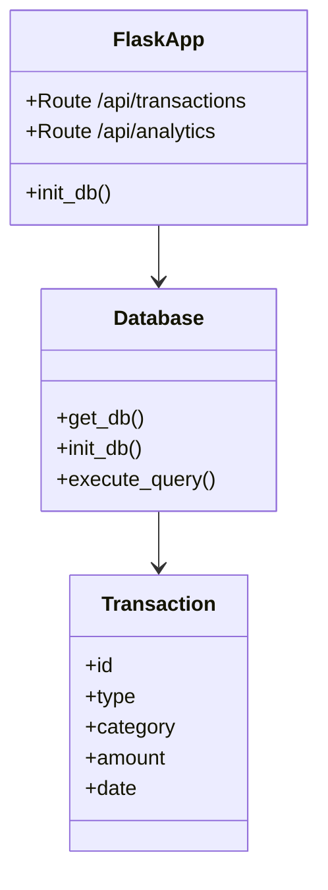
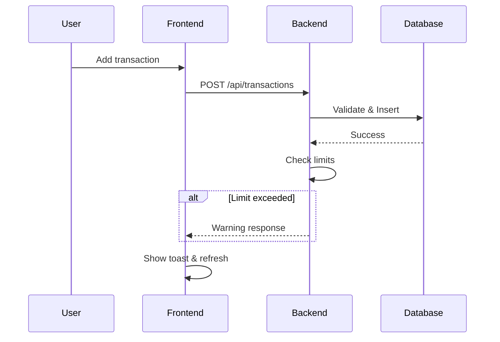

# Design and Implementation of Real-Time Web-Based Expense Tracker with AI Analytics

## 1. INTRODUCTION		4
### 1.1. Project Overview  
The Expense Tracker is a full-stack web application developed using Flask, SQLite, HTML/CSS/JavaScript. It provides real-time expense monitoring, category budget limits, AI-powered insights, and predictive analytics to help users manage personal finances proactively.

### 1.2. Objectives & Scope  
Primary objectives: Real-time dashboard, intelligent alerts, AI recommendations. Scope includes CRUD operations, analytics API, responsive UI for desktop/mobile.

## 2. SYSTEM REQUIREMENTS & SPECIFICATION		4
### 2.1. Functional Requirements  
- Add/edit/delete income/expense transactions  
- Set category limits with real-time violation detection  
- Generate daily/weekly/monthly analytics  
- AI chatbot for financial queries and insights  

### 2.2. Non-Functional Requirements & Tech Stack  
Performance: <100ms API responses. Tech: Flask backend, SQLite DB, vanilla JS frontend, Chart.js visualizations.

## 3. LOW-LEVEL DESIGN (LLD)		4
### 3.1. API Design & Core Functions  
Key functions: `get_detailed_analytics()`, `get_expense_warnings()`. Endpoints: `/api/transactions`, `/api/analytics/detailed`, `/api/ai_insights`.

### 3.2. Data Flow & Business Logic  
Transaction → Limit check → Warning generation → Dashboard refresh (30s interval) → AI analysis.

## 4. MODELING (UML DIAGRAMS)		4
### 4.1. Class Diagram  



### 4.2. Sequence Diagram: Add Transaction  



## 5. DATABASE DESIGN		4
### 5.1. Schema Design  
```sql
CREATE TABLE transactions (
    id INTEGER PRIMARY KEY,
    type TEXT CHECK(type IN ('income','expense')),
    category TEXT NOT NULL,
    amount REAL NOT NULL,
    date TEXT NOT NULL
);
```

### 5.2. Key Queries & Indexes  
Daily summary: `SELECT SUM(amount) FROM transactions WHERE type=? GROUP BY strftime('%Y-%m-%d', date)`. Indexed on (user_id, category, date).

## 6. IMPLEMENTATION AND TESTING		4
### 6.1. Core Implementation Highlights  
Backend: Flask routes with SQLite integration. Frontend: State management, parallel API calls, CSS animations (pulse/wiggle). AI: Gemini API fallback.

### 6.2. Testing Strategy  
Unit: API endpoints, analytics calculations. Integration: End-to-end transaction flow. UI: Limit violation visuals, auto-refresh.

## 7. CONCLUSION AND FUTURE SCOPE		4
### 7.1. Achievements  
Delivered production-ready app with real-time features, achieving 60fps animations and scalable architecture.

### 7.2. Future Enhancements  
ML anomaly detection, PDF reports, multi-user support, email alerts, yearly analytics.

